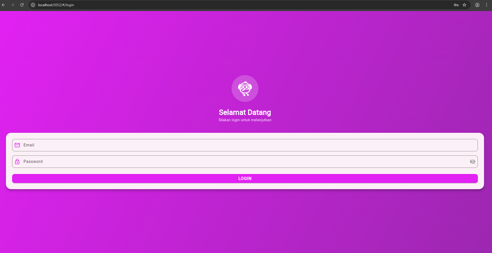
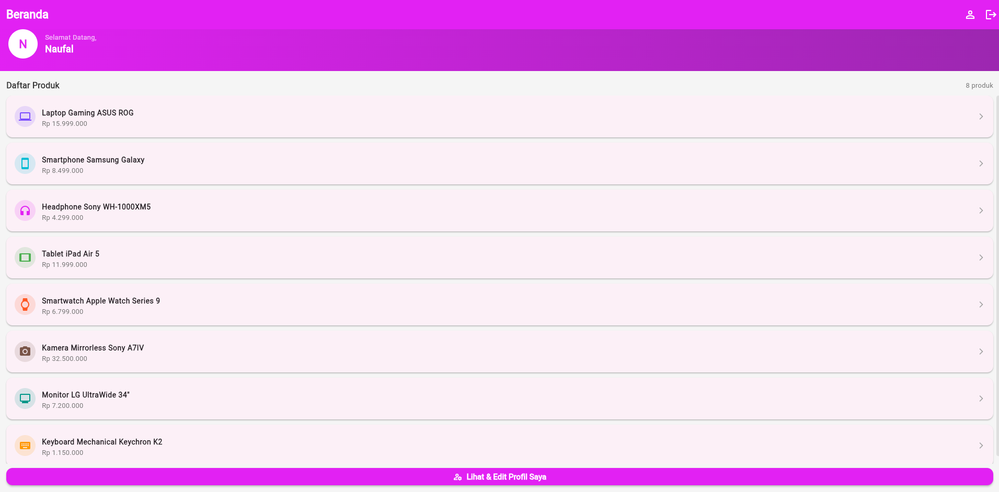
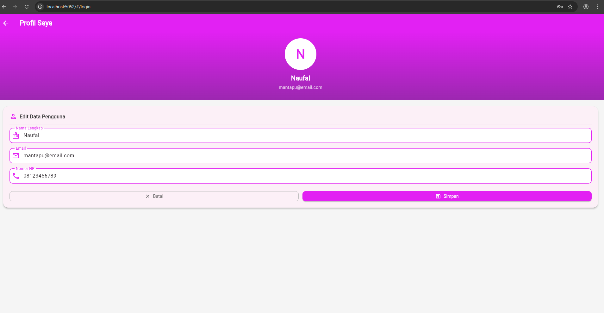

# UTS Mobile Flutter - Dini Oktivia - Sep Naufal

## Deskripsi Aplikasi

Aplikasi Mobile Flutter sederhana yang menampilkan sistem login dan halaman home. Aplikasi ini dikembangkan sebagai tugas UTS untuk mata kuliah Mobile Development dengan teknologi Flutter dan Dart. Aplikasi memiliki UI yang menarik dengan Material Design dan implementasi form validation yang proper.

## Tujuan Aplikasi

- Memahami dan mengimplementasikan sistem autentikasi/login di Flutter
- Mempelajari penggunaan StatefulWidget dan StatelessWidget
- Mengimplementasikan form validation dengan Flutter
- Mempraktikkan navigasi antar halaman menggunakan Navigator
- Mendesain UI yang menarik dengan Material Design
- Memahami lifecycle dan state management dasar di Flutter

## Fitur Aplikasi

### 1. **Halaman Login**
   - Form input username dengan validasi minimal 6 karakter
   - Form input password dengan validasi minimal 6 karakter
   - Tombol login dengan validasi form yang komprehensif
   - Pesan error dinamis untuk setiap field dalam Bahasa Indonesia
   - Desain UI dengan warna gradient ungu (#E221F3)
   - Responsive layout menggunakan Padding dan Column

### 2. **Halaman Home**
   - Menampilkan sambutan dengan nama username yang berhasil login
   - Kartu ucapan selamat datang dengan desain menarik
   - Header AppBar dengan styling konsisten
   - Menampilkan pesan sukses login
   - Layout yang rapi dengan proper spacing

### 3. **Validasi Form**
   - Username harus diisi dan minimal 6 huruf
   - Password harus diisi dan minimal 6 karakter
   - Pesan validasi error spesifik untuk setiap kondisi
   - Semua pesan dalam Bahasa Indonesia
   - Validasi real-time pada field

### 4. **Navigasi & State Management**
   - Transisi halaman smooth menggunakan MaterialPageRoute
   - Passing data username ke halaman berikutnya
   - State management menggunakan StatefulWidget

## Teknologi yang Digunakan

- **Framework**: Flutter
- **Bahasa**: Dart
- **Design Pattern**: Material Design
- **State Management**: StatefulWidget/StatelessWidget

## Struktur Project

```
lib/
├── main.dart          # Entry point & halaman login
├── home.dart          # Halaman home setelah login
└── login.dart         # File login terpisah (jika ada)
```
## 📸 Screenshot Aplikasi

### Halaman Login


### Halaman Home


### Halaman Profile


## Cara Menjalankan Aplikasi

### Prerequisites
- Flutter SDK sudah terinstall
- Dart SDK sudah terinstall
- Browser (Chrome/Edge) untuk menjalankan web version

### Langkah-langkah

1. **Clone repository**
   ```bash
   git clone https://github.com/dinioktavia2306095/UTS-Mobile-Flutter-Dini-Oktivia.git
   cd UTS-Mobile-Flutter-Dini-Oktivia
   ```

2. **Install dependencies**
   ```bash
   flutter pub get
   ```

3. **Jalankan aplikasi di Chrome (Web)**
   ```bash
   flutter run -d chrome --web-renderer html
   ```

4. **Atau jalankan di Android/iOS**
   ```bash
   flutter run -d android
   flutter run -d ios
   ```

## Instruksi Login

- **Username**: Minimal 6 karakter (contoh: `admin123`)
- **Password**: Minimal 6 karakter (contoh: `password123`)

Setelah login berhasil, Anda akan diarahkan ke halaman home yang menampilkan sambutan personal.

## Struktur File

```
UTS-Mobile-Flutter-Dini-Oktivia/
├── lib/
│   ├── main.dart       # Entry point aplikasi & LoginPage
│   ├── home.dart       # HomePage
│   └── login.dart      # (jika ada)
├── pubspec.yaml        # Dependencies dan project configuration
├── README.md           # Documentation
└── ...                 # File configuration lainnya
```

## Author

- **Nama**: - Dini Oktivia Safitri 
            - Sep Naufal Dzimar Sadli
- **NIM**:  - 2306095
-           - 2306078
- **Mata Kuliah**: UTS Mobile Development

## Lisensi

Project ini dibuat untuk tujuan pendidikan.
